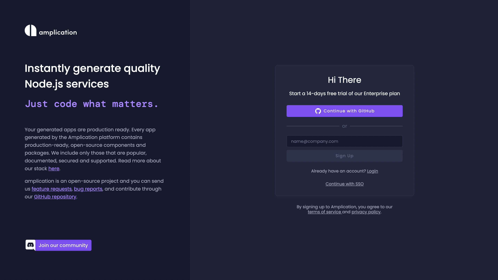

# Create Your First Service With Amplication

Amplication accelerates your app development by helping you build production-ready backends in either Node.js or .NET. These automatically-generated backends, known as **services**, utilize modern frameworks such as NestJS and Prisma for Node.js, and ASP.NET Core alongside Entity Framework Core for .NET.

Each service includes both REST and GraphQL APIs and comes with an interactive React Admin UI. These services offer a comprehensive solution that encompasses authentication, authorization, logging, git synchronization, and other critical backend management functionalities.

This guide will help you create your first service using our streamlined service creation onboarding wizard.

## Prerequisites

First, [sign up](https://app.amplication.com/login) for an Amplication account with GitHub or your _business_ email address.



If this is your first time using Amplication, the Service Creation Wizard start automatically will guide you through the process.

## Step 1: Name Your Service

When naming your service, consider its primary function. What will it do? What problem is it solving? An appropriately named service will be easier to identify and maintain.


## Step 2: Connect Your GitHub Repository

Amplication will keep your generated service [synced with a GitHub](/sync-with-github/) repository that you choose.

First, install the Amplication GitHub App into your account or organization.


Next, select the repository to store your generated code.
You can also create a new repository by clicking on the **Create repository** button.


:::note
In addition to GitHub, Amplication also supports [Bitbucket](/sync-with-bitbucket) and [AWS CodeCommit](/sync-with-aws-codecommit) for Enterprise users.
:::

## Step 3: Customize Your Service

Amplication can generate GraphQL APIs, REST APIs, and an Admin UI for each of your services. Select the components you need for your service.


## Step 4: Select Your Repo Style 

Choose how your service will be stored in your repository: *Monorepo* or *Polyrepo*.

**Monorepo** generates a folder at the root and stores services in specified sub-folders. 

```
./apps
  - apps/my-new-service 
  - apps/my-new-service-admin
```

:::tip
Monorepo is recommended if you plan on having multiple services in a single GitHub repository
:::

**Polyrepo** stores each service in individual folders at the root of your repository.

```
- ./my-new-service
- ./my-new-service-admin
```


## Step 5: Choose Your Database

Amplication supports PostgreSQL, MongoDB, and MySQL out of the box. Choose the one that suits your needs.

:::tip
You're not locked into your choice - you can always change your database type later in your project's plugin page.
:::


## Step 6: Define Your Data Model

Define entities and fields for your database. You can manually define your own or use a template provided by Amplication.

:::info
Entities are the objects you want to keep track of in your app, like a User or a Product. They become tables in your database. Each row represents an instance of the entity.

A field is a column in that table that represents an attribute of that entity.
:::


## Step 7: Include Authentication (Optional)

You can optionally choose to include all the necessary code for [authentication](/authentication/) in your service. If your service does not require authentication, select the `Skip Authentication` option.


## You're Done!

Congratulations! You've successfully set up your first service on Amplication. You will now be taken to a screen where Amplication will start generating all the necessary code for your service. You can watch this happen in real time.


Clicking on the `View my code` button will take you to the GitHub repository you chose in Step 2. Specifically, you'll see Amplication's first commit to that repository.

:::note
If you're curious about what the generated code for a service looks like, we have an example on GitHub for you. Check out the following repository:

[Amplication Generated Service Sample App](https://github.com/amplication/sample-app)
:::


## Next Steps

After successfully creating your first service, the next steps are to create entities for your new service: [Set Up Entities, Roles, and Permissions On Your Service](/entities-roles-permissions)

You can also [learn more](/getting-started/) about the specific details, structure, and technologies that a service consists of.