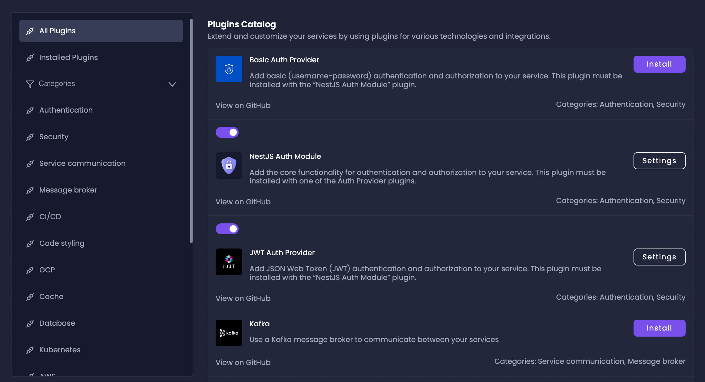
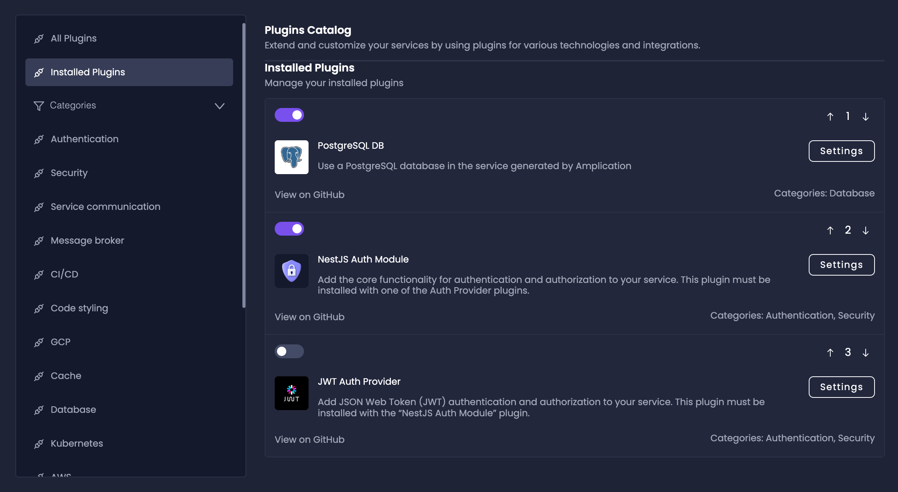
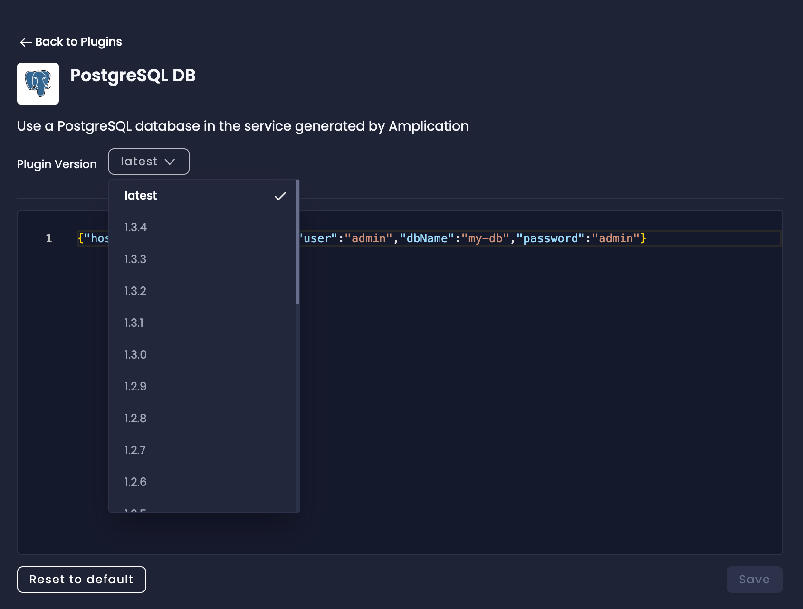

Amplication uses _Plugins_ to extend the functionality of your generated code.

Some plugins can be enabled when you first create your service.
For example, if you choose MySQL as your database, the _MySQL DB_ plugin will be enabled.
If you choose to turn on authentication for your service, that will enable the _NestJS Auth Module_ plugin and other required Authentication-focused plugins.

All community plugins published by Amplication are available on your service's _Plugins_ tab.
Plugins can be enabled or disabled on this tab. In addtion, you can click on the _Settings_ button and configure the settings of each plugin there.
To view your installed plugins, click on the _Installed Plugins_ page in the filter panel on the left side.
The source code of all community Amplication plugins are [available on GitHub](https://github.com/amplication/plugins).

Besides the available community plugins, you can [develop your own custom plugins](/plugins/overview/).

## Community Plugins List 

You can view all community plugins on the _All Plugins_ page.
They're also available on the [Community Plugins](/plugins-list) page here on the Amplication documentation.

## How To Install A Plugin

To install a plugin:

1.  In  your service's _Plugins_ tab, click **Install** for the required plugin.

2. For streamlined searching, click on **Categories** in the filter panel to browse plugins by type.

3. Click on the plugin's toggle switch to activate it, changing its status to the _on_ state.

4. Click on the _Installed Plugins_ page on the filter panel on the left side. The installed plugins are listed.

5. To see the plugin's code on GitHub, click the **View on GitHub** link.

## How To Uninstall A Plugin

To uninstall a plugin, click the toggle switch into its _off_ state.

## How To View Open-Source Plugin Code

All Amplication plugins are open-source and available on GitHub.
You can find the plugin source code for each individual plugin in Amplication's [`plugins`](https://github.com/amplication/amplication-plugins) repository.

## How To Modify Plugin Execution Order

The plugins are executed when Amplication generates code, according to their order on the *Installed Plugins* page.

:::tip
If a plugin execution is a prerequisite for another plugin, it must be located earlier in the list.
:::

- To change the order of the installed plugins, click the up or down arrow to the right of the plugin bar.

## How To Change a Plugin's Version

Amplication plugin developers may release several versions of a plugin over time.
Sometimes, you might need to generate a project with an earlier version of the plugin, to ensure compatibility.

By default, the latest version of the plugin will be available in the list of plugins.

1. To change the installed version of a plugin, in the **All Plugins** page, click the **Settings** icon.

   The plugin’s settings page opens.

   

2. Select the required plugin version from the Plugin version drop-down list and click **Save**.

   In the next build, the code will be generated with the selected plugin version.

:::note
Each version of the Plugin has its own settings, so when you replace the version you also replace its settings.
:::

## How To Develop a Custom Plugin

To add more functionality, you can develop your own plugins, or can use plugins developed by the community, as they become available.

See [Plugin Development Overview](/plugins/overview/) for more information.
