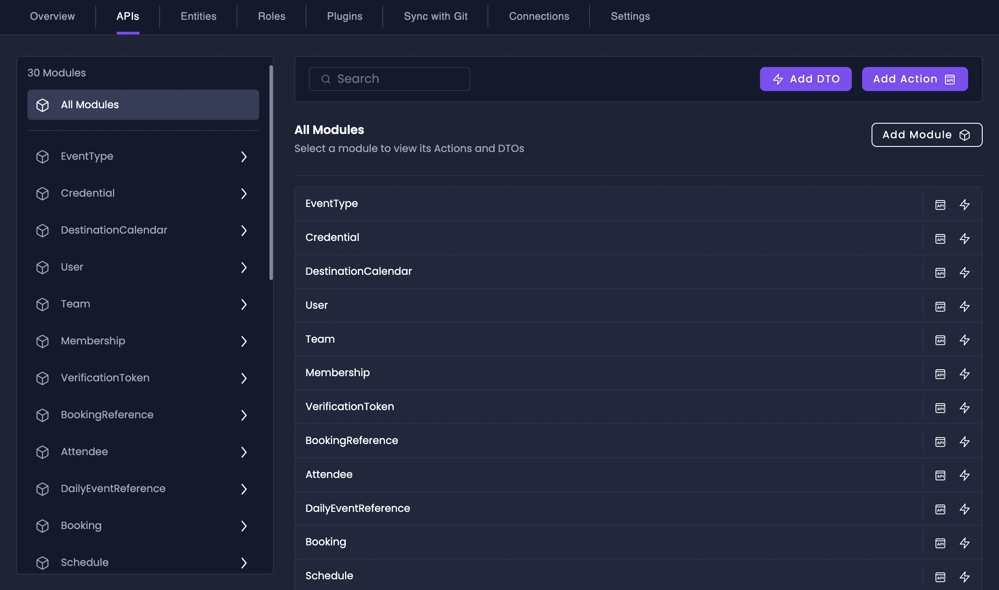
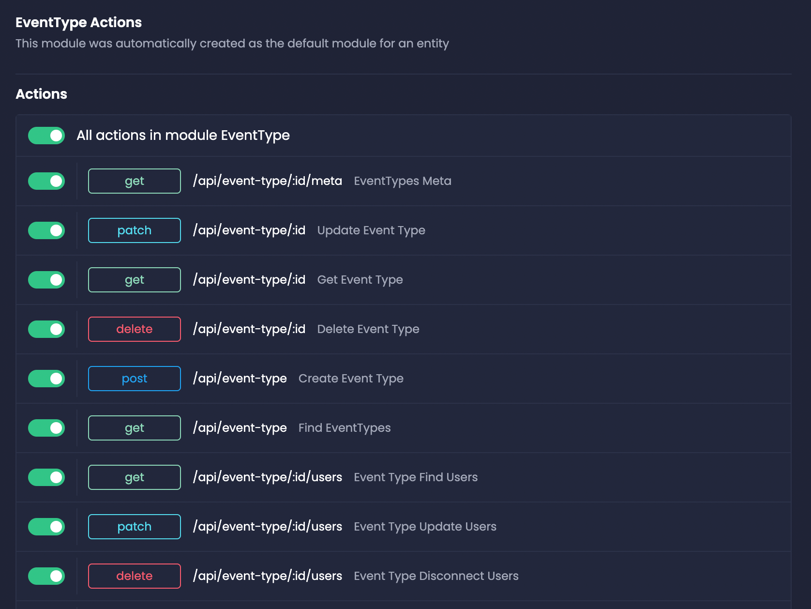

# Custom Types & Actions

Custom Types & Actions is an enhanced feature that gives you full control over your Data Transfer Objects (DTOs) and APIs. It allows you to automatically generate high-quality, efficient code for both the default CRUD operations and your custom APIs that utilize custom DTOs, all within your REST and/or GraphQL APIs.

Custom Types & Actions let you define custom data structures, create API endpoints, and manage the relationships between them, all within the Amplication UI. These changes are automatically translated into production-ready code in your repository, ensuring the best quality and ,efficiency.

:::note
The Custom Types & Actions feature is available for Amplication's **Enterprise** plan, including trial plans.
:::

## Accessing Custom Types & Actions

To access the Custom Types & Actions feature, navigate to the new **APIs** tab in your Amplication dashboard.

The APIs tab provides a centralized view of all your project's Modules, DTOs, and Actions. It's also further divided into sections for each Module, making it easy to browse and manage your project's custom types and actions.

## Modules

Modules are organizational units that group related DTOs and Actions together. They help structure your application in a logical and maintainable way.

Modules are closely tied to entities in your application, with each entity being generated as a Module containing all the entity's code (DTOs, APIs, and more). Each Module is generated as a folder containing all the DTOs and APIs code related to that Module. You can also create additional Modules based on your business needs and requirements.

### Create Module

To create a new Module, follow these steps:

1. In the APIs tab, click on "All Modules" in the sidebar.
2. Click on the "Add Module" button.
2. Provide a name for your Module.
3. Click the "Create Module" button to finalize the creation process.

### Edit Module

To edit an existing Module, follow these steps:

1. In the APIs tab, locate the Module you want to edit.
2. Click on the Module name to open the Module details page.
3. Click on the "Edit Module" button to open the Module edit page.
3. Modify the Module name and description as needed.
4. Your changes will be saved automatically.

### Delete Module

To delete a Module, follow these steps:

1. In the APIs tab, locate the Module you want to delete.
2. Click on the Module name to open the Module details page.
3. Click on the "Edit Module" button to open the Module edit page.
4. Click the delete icon next to the Module name.
5. Confirm the deletion when prompted.

:::danger
You can only delete Modules that you have created. Amplication-generated Modules (based on entities) cannot be deleted.

Deleting a Module will also delete all the DTOs and Actions within that Module. Exercise caution when deleting Modules.
:::

## DTOs and Enums

Data Transfer Objects (DTOs) define the structure and format of data that is transferred between different parts of your application, particularly between the client and the server, or between different services within the application.

In Amplication, DTOs serve several purposes:

- They define the input and output data structures for API endpoints (Actions).
  - For REST APIs, they can be used as request and response bodies.
  - For GraphQL APIs, they can be used as input types (arguments) and return types.
- They can define the data transferred between services as part of an event-driven architecture using a message broker (planned for future versions).

Amplication provides built-in DTOs for common use cases, such as pagination, sorting, and filtering. These DTOs are automatically generated based on your application's entities to support the CRUD APIs generated out-of-the-box. However, you can also create custom DTOs to suit your specific requirements and use them in your custom APIs.

### Differences between DTOs and Enums

Enums are used to define a fixed set of constants. DTOs are used to define the structure and shape of data objects that are transferred between different parts of the project.

In Amplication, you can create and manage both enums and DTOs using the Custom Types & Actions feature, allowing you to define the data contracts and constraints for your application's API endpoints. A specific enum can also function as a DTO and can be defined as the input or output DTO for an API.

### Create DTO

To create a new DTO, follow these steps:

#### DTO Name and Description

1. Click on the "Add DTO" button in the top right of the APIs tab.
2. In the dropdown, click on "Add DTO".
3. Provide a name for your DTO, such as "MyNewDtoName". This will automatically populate the Name field with the provided name.
4. Optionally, add a description for your DTO.

#### Adding Properties

1. In the "Properties" section, click on "Add property" to define the DTO's properties.
2. For each property:
   - Specify the Name of the property (e.g., "firstProperty").
   - Choose the Type of the property from the dropdown (e.g., "String", "Number", "Boolean", "Date", "JSON", "DTO", "Enum").
   - If needed, you can change the property to an array by toggling the "Array" switch.
   - Mark the property as optional by checking the "Optional" checkbox.
3. Repeat step 2 for each additional property you want to add to the DTO.
4. If you need to define a union type for a property, click on "+ Add union type" and specify the types for the union.

#### Finalizing DTO Creation

Click the "Create DTO" button to finalize the creation process.

After completing these steps, your new DTO will be created within the selected Module, and you can further customize its properties and relationships as needed.

### Create Enum

To create a new Enum, follow these steps:

#### Enum Name and Description

1. Click on the "Add DTO" button in the top right of the APIs tab.
2. In the dropdown, click on "Add Enum".
3. Provide a name for your Enum, such as "MyNewEnum". This will automatically populate the Name field with the provided name.
4. Optionally, add a description for your Enum.

#### Adding Members

1. In the "Members" section, click on "Add member" to define the Enum's members.
2. For each member:
   - Specify the Name of the member.
   - Provide the Value for the member.
3. Repeat step 2 for each additional member you want to add to the Enum.

#### Finalizing Enum Creation

Click the "Create Enum" button to finalize the creation process.

After completing these steps, your new Enum will be created within the selected Module, and you can use it as a type for properties in your DTOs or as input/output types for your Actions.

### Edit DTO or Enum

To edit an existing DTO, click on the DTO within its associated Module in the APIs tab. You can modify the DTO's name, description, and properties as needed. Remember to save your changes when you're done.

## Actions

Actions represent the API endpoints that define the operations available in your application. They specify the HTTP methods, paths, input, and output data structures for each endpoint.

Actions use DTOs to define their input and output data. Each Action can have a request DTO (for input) and a response DTO (for output). Amplication generates built-in Actions based on your application's entities for CRUD operations, but you can also create custom Actions to implement specific functionality.

:::note
The generated Amplication service has support for HTTP mode only. Our [HTTPs plugin](https://amplication.com/plugins/transport-https) adds support for HTTPS mode and TLS termination at the app level.
:::

### Create Action

To create a new Action, follow these steps:

#### Module Name and Description

1. Click on the "Add Action" button in the top right of the APIs tab.
2. Provide a Display Name for your new Action, such as "My New Module Name". This will automatically populate the Name field with a generated name like "MyNewModuleName".
3. Optionally, add a description for your Action.

#### Choosing Types

1. In the "Types" section, select the input and output types for your Action:
   - For the Input Type, choose "DTO" from the dropdown and click "Select..." to pick an existing DTO or create a new one.
   - For the Output Type, choose "DTO" from the dropdown and click "Select..." to pick an existing DTO or create a new one.
2. If needed, you can change the Input Type or Output Type to an array by toggling the "Array" switch.

#### REST API Settings

1. Choose the appropriate HTTP Method from the dropdown (e.g., "get", "post", "put", "delete").
2. Specify the Path for your Action (e.g., "/id/my-new-module-name").
3. Select the Input Source for your Action's parameters (e.g., "body", "query", "params", or "split") from the dropdown.

#### GraphQL API Settings

Choose the Operation Type for your Action (e.g., "query" or "mutation").

#### Finalizing Action Creation

Click the "Create Action" button to finalize the creation process.

After completing these steps, your new Action will be created within the selected Module, and you can further customize its settings and behavior as needed.

### Enable and Disable Actions

Amplication gives you a complete overview of all Actions associated with a specific Module.

This is useful when you want to temporarily disable certain endpoints without completely removing them from your application.

To enable or disable an Action, simply toggle the switch next to the Action's name in the APIs tab.

:::caution
Disabling an Action will cause Amplication not to generate the code for that Action.
:::

### Edit and Delete Action

To edit an Action, click on the Action within its associated Module in the APIs tab. You can modify the Action's properties, such as the HTTP method, path, input DTO, output DTO, and other settings as needed. Remember to save your changes when you're done.

To delete an Action, click on the delete button next to the Action's name. Be cautious when deleting Actions, as it may impact other parts of your application that depend on them.

:::note
Moving or duplicating Actions (and DTOs) is currently not be supported.
:::

## Conclusion

Custom Types & Actions in Amplication provide a powerful and flexible way to define and manage your application's data structures and API endpoints. By leveraging custom DTOs and Actions, you can create a tailored and efficient API that meets your specific requirements and generates the production-ready code for it in your repository.